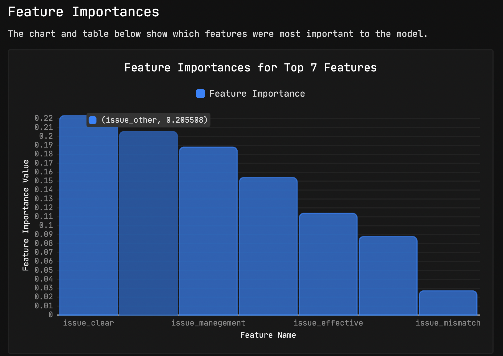
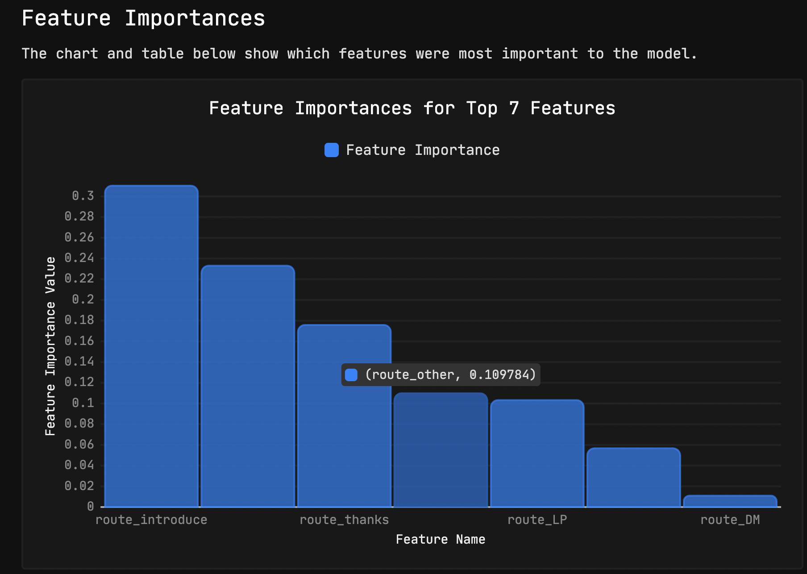

---
# Feel free to add content and custom Front Matter to this file.
# To modify the layout, see https://jekyllrb.com/docs/themes/#overriding-theme-defaults

layout: home
---
## 集客数の沖積図

- 2週目が一番集客人数が多い
- 月曜、火曜が比較的多く見られる
- アーカイブ、ライブでは若干、アーカイブのほうがmidium,highが高い、しかしhighはライブがおおい




|Feature Name|Feature Importance Value|
|:----|:----|
|word_saiyou = 0|0.05032429|
|word_soshiki = 0|0.041170876|
|word_seminar = 0|0.038737047|
|word_kata_houhou = 0|0.038339358|
|word_mensetsu = 0|0.03608073|
|word_nyumon = 0|0.03190558|
|stream = archive|0.030059153|
|word_rinsyusinri = 0|0.028589815|
|start_time = 12:00:00 PM|0.028239125|
|department_other|0.02738507|
|word_sinrigaku = 1|0.026914636|
|DM = 0|0.02660078|
|word_jinji = 0|0.025523067|
|position_regular|0.024371652|
|word_jinji = 1|0.024263553|
|DM = 1|0.02318584|
|word_sinrigaku = 0|0.022871979|
|position_other|0.021745028|
|word_rinsyusinri = 1|0.021196807|
|position_chief|0.02118849|
|day = Wed|0.020816343|
|route_introduce|0.020300029|
|stream = live|0.019727463|
|department_hr_other|0.019039271|
|position_manager|0.018108081|
|word_nyumon = 1|0.017881034|
|week = forth|0.017660702|
|start_time = 3:00:00 PM|0.017293677|
|route_FB|0.016967224|
|route_other|0.016462184|
|position_president|0.0152349705|
|position_board|0.015099133|
|route_jinjibu|0.014492522|
|week = second|0.013849987|
|word_mensetsu = 1|0.01370589|
|position_director|0.013619309|
|route_LP|0.0128339995|
|day = Tue|0.012754234|
|week = fifth|0.01194578|
|word_kata_houhou = 1|0.011447264|
|perpose_mismatch|0.011265057|
|word_seminar = 1|0.011049574|
|word_soshiki = 1|0.00861575|
|department_hr_dev|0.008445618|
|route_thanks|0.008393229|
|day = Thu|0.0075026886|
|day = Mon|0.0070083416|
|department_corp|0.006546642|
|week = first|0.0055072224|
|department_hr_recruit|0.0055057895|
|route_DM|0.0049089007|
|start_time = 2:00:00 PM|0.0026180411|
|day = Fri|0.0017050125|
|start_time = 11:00:00 AM|0.0016357739|
|week = third|0.0008229305|
|word_saiyou = 1|0.0005376738|

|Feature Name|Feature Importance Value|
|:----|:----|
|issue_clear|0.22327411|
|issue_other|0.20550844|
|issue_manegement|0.18809713|
|issue_population|0.15404074|
|issue_effective|0.1140031|
|issue_reduce|0.08797369|
|issue_mismatch|0.027102767|

|Feature Name|Feature Importance Value|
|:----|:----|
|route_introduce|0.3103273|
|route_jinjibu|0.23302078|
|route_thanks|0.17589776|
|route_other|0.10978358|
|route_LP|0.103220545|
|route_FB|0.056749642|
|route_DM|0.0110004125|
